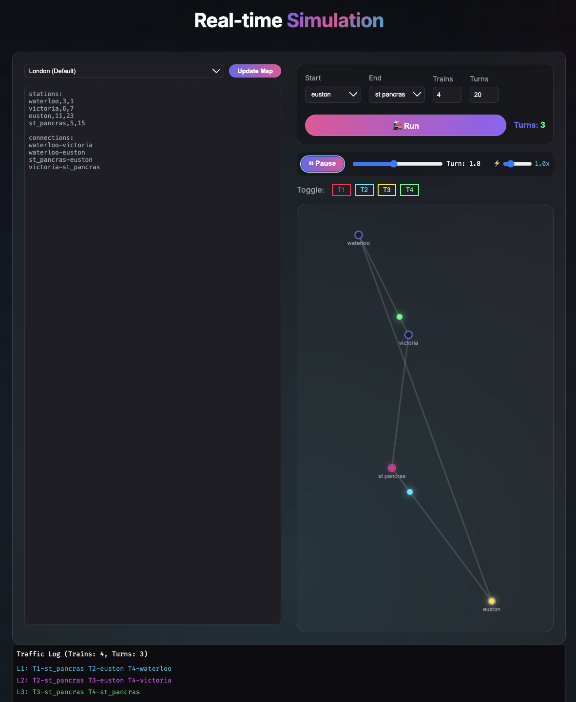
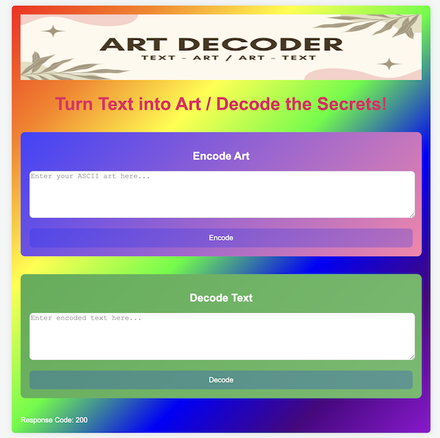
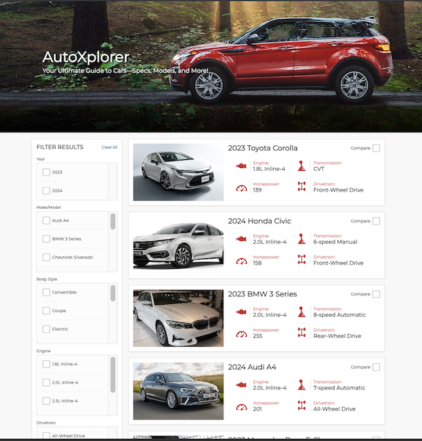

<h1 align="center">👋 Hi, I'm Suresh Pun</h1>

<h3 align="center">🍽️ Chef turning into Full Stack Developer</h3>

  <a href="#journey">My Journey</a> •
  <a href="#education">Education</a> •
  <a href="#skills">Skills</a> •
  <a href="#experience">Experience</a> •
  <a href="#contact">Contact</a> •
  <a href="#projects">Projects</a>

## 🚀 My Journey

Currently, I am learning **Go, JavaScript, and TypeScript** at **@ Kood/Sisu**, applying the same discipline I honed in professional kitchens to writing clean, maintainable code.

<table border="0" width="100%">
  <tr>
    <td align="center" width="33%">
        <h4>👨‍🍳 The Origin</h4>
        <small>10+ Years of High-Pressure Leadership & Teamwork in Culinary Arts</small>
    </td>
    <td align="center" width="33%">
        <h4>🎯 The Mission</h4>
        <small>Learning, Building, Improving</small>
    </td>
    <td align="center" width="33%">
        <h4>🔮 The Future</h4>
        <small>Continuous Learning programming languages and frameworks</small>
    </td>
  </tr>
</table>

---

## 🎓 Education

- **Full Stack Developer** – @Kood Sisu (2025–Ongoing)
- **Vocational Qualification in Restaurant & Catering** – Varia (2022)
- **Bachelor of Business Information Technology** – Haaga-Helia (2015)
- **Business Administration** – Helsinki Business College (2009)

---

## 🛠 Skills

### Languages

### Web Technologies

### Tools & Platforms

### Other
- **Networking & Server Management**
- **MS Office**
- **Spoken Languages:** English (Fluent), Finnish (Basic)

---

## 💼 Work Experience

- **Cook** – HMS Host Finland / Avolta (2022–2023, 2024–Present)
- **Cook** – StaffPoint / SSP (2023–2024)
- **Cook** – StaffPoint (2021–)
- **All-Rounder** – Fafa’s Kaari & Tripla (2021)
- **Cook** – Attendo (2021)
- **Delivery** – Posti (2017)

---

## 📫 Get In Touch

I'm always open to discussing new projects, creative ideas, or opportunities.

- ✉️ **Email:** [punsuresh@hotmail.com](mailto:punsuresh@hotmail.com)
- 💼 **LinkedIn:** [Let's Connect Professionally](https://www.linkedin.com/in/suresh-pun)
- 🌐 **Portfolio:** [sureshpun.github.io/portfolio](https://sureshpun.github.io/portfolio/)

---

## 📂 Projects

🚀 *More exciting projects are yet to come!*

  <tr>
    <td width="33%" align="center">
      <h3>🚉 Stations Pathfinder</h3>
      
      
A Go-based command-line tool for optimal train routing and collision avoidance.

      <a href="./projects/stations-pathfinder.md"><b>View Project Details &rarr;</b></a>
       
      <a href="https://kood-sisu-stations-pathfinder.netlify.app/"><i>Live Demo</i></a>
    </td>
    <td width="33%" align="center">
      <h3>🎭 Art Decoder</h3>
      
      
A web-based application built with Go to encode and decode ASCII art using custom logic.

      <a href="./projects/art-decoder.md"><b>View Project Details &rarr;</b></a>
       
      <a href="https://sureshpun.github.io/portfolio/projects/art-decoder.html"><i>Live Demo</i></a>
    </td>
    <td width="33%" align="center">
      <h3>🚗 Cars Viewer</h3>
      
      
A Go-based car viewer app with dynamic filtering, comparison features, and detailed specs.

      <a href="./projects/car-viewer.md"><b>View Project Details &rarr;</b></a>
       
      <a href="https://sureshpun.github.io/portfolio/projects/car-viewer.html"><i>Live Demo</i></a>
    </td>
  </tr>
</table>

---

  <i>© 2025 Suresh Pun · Built with ❤️</i>

