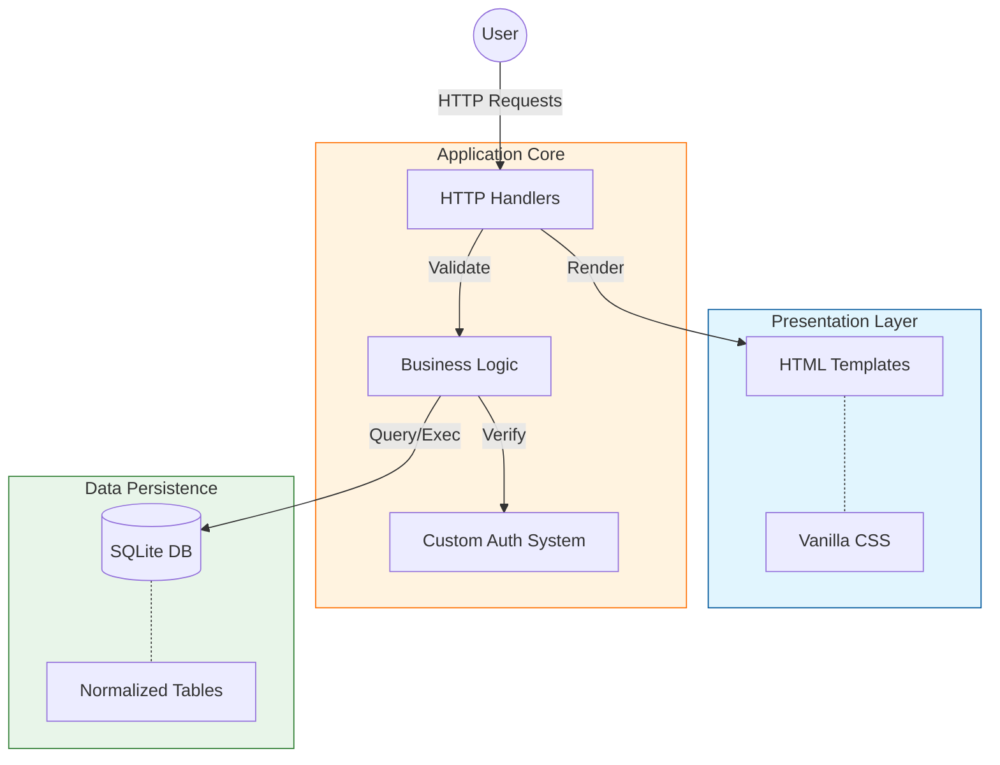

<h1 align="center">🦁 Literary Lions Forum</h1>

**[View Live Project Details](https://sureshpun.github.io/portfolio/projects/literary-lions-forum.html)**

**Literary Lions Forum** is a modern, high-performance discussion platform built from scratch with **Go** and **SQLite**. It offers a clean, responsive interface for users to engage in meaningful discussions, featuring custom authentication and a dynamic engagement system.

## 🌟Key Features

- **🔐 Custom Authentication**: Secure registration and login with session management.
- **📝 Full CRUD**: Create, read, update, and delete posts seamlessly.
- **💬 Engagement**: Threaded comments and interactivity (Likes/Dislikes).
- **📂 Categorization**: Filter content by topics like Movies, Books, and Games.
- **👤 User Profiles**: Customizable profiles with activity tracking.

## ✨Usage

**Register:** Create a new account with email, username, and password.

**Log in:** Access the forum using your credentials.

**Create posts:** Share your thoughts and literary insights.

**Comment & react:** Participate in discussions by commenting and liking posts or comments.
The interface is designed with simplicity and clarity, ensuring an intuitive user experience.

## 🛠️ Core Tech Stack

- **Language**: Go (Golang) 1.24+ - High performance and type safety.
- **Database**: SQLite - Serverless, transactional SQL.
- **Frontend**: Go Templates (SSR) & Vanilla CSS.
- **Infrastructure**: Docker & Docker Compose.

## 🌐 Web Visualization

## 📺 Project Preview

[← Back to Profile](../README.md)
